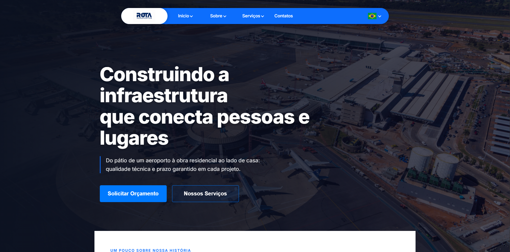

# Rota Aeroportos e Construções - Landing Page 

> Uma landing page para uma empresa de infraestrutura e construção de aeroportos.


<div align="center">
  
</div>

---

## 📖 Sobre o Projeto

Esta é uma landing page corporativa para a **Rota Aeroportos**, uma empresa que constrói infraestrutura pesada, projetos residenciais e aeroportos. 

Construí este projeto como parte do meu portfólio e para um ex-empregador. Ele mostra como eu abordo requisitos de interface e performance. O objetivo foi criar um site rápido, multilíngue e com animações sutis de rolagem.

## ✨ Principais Funcionalidades e Detalhes Técnicos

- **Internacionalização (i18n):** Um serviço de idiomas personalizado alterna entre Português (PT) e Inglês (US) sem recarregar a página.
- **Otimização de Assets:** Em vez de carregar SVGs pesados como arquivos externos, os gráficos e logos são compilados diretamente no JavaScript usando um componente Angular standalone (`<app-icon>`).
- **Interface e Animações:** O header fixo se adapta ao rolar a página, e o design utiliza glassmorphism e transições CSS para os elementos interativos.
- **Arquitetura Angular:** O aplicativo usa componentes standalone do Angular 17+, a nova sintaxe de controle de fluxo (`@if`, `@for`, `@switch`) e Signals para gerenciamento de estado.
- **Estilização:** O layout foi escrito em SCSS puro, sem frameworks CSS como Bootstrap ou Tailwind, mantendo o estilo isolado e sob controle.

## 🛠️ Tecnologias e Ferramentas

- **Framework:** Angular 17+
- **Estilização:** SCSS (metodologia BEM, Flexbox/Grid)
- **Tipografia:** Inter e Exo (Google Fonts)
- **Ícones e Assets:** SVGs inline encapsulados em componentes standalone

## 🚀 Como Executar

Para rodar este projeto localmente:

### Pré-requisitos
- Node.js (v18 ou superior)
- Angular CLI (`npm install -g @angular/cli`)

### Instalação

1. Clone o repositório:
   ```bash
   git clone https://github.com/WalyssonCavalcante/ROTA-LANDING-PAGE.git
   ```
2. Acesse a pasta do projeto:
   ```bash
   cd ROTA-LANDING-PAGE
   ```
3. Instale as dependências:
   ```bash
   npm install
   ```
4. Inicie o servidor de desenvolvimento:
   ```bash
   ng serve
   ```
5. Abra o navegador e acesse `http://localhost:4200/`.

## 👨‍💻 Autor

**Walysson Cavalcante**
- GitHub: [@WalyssonCavalcante](https://github.com/WalyssonCavalcante)
- LinkedIn: [www.linkedin.com/in/walysson-cavalcante]


